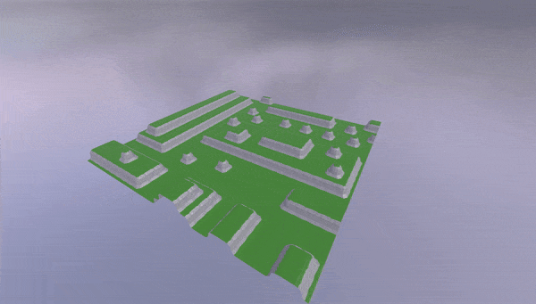
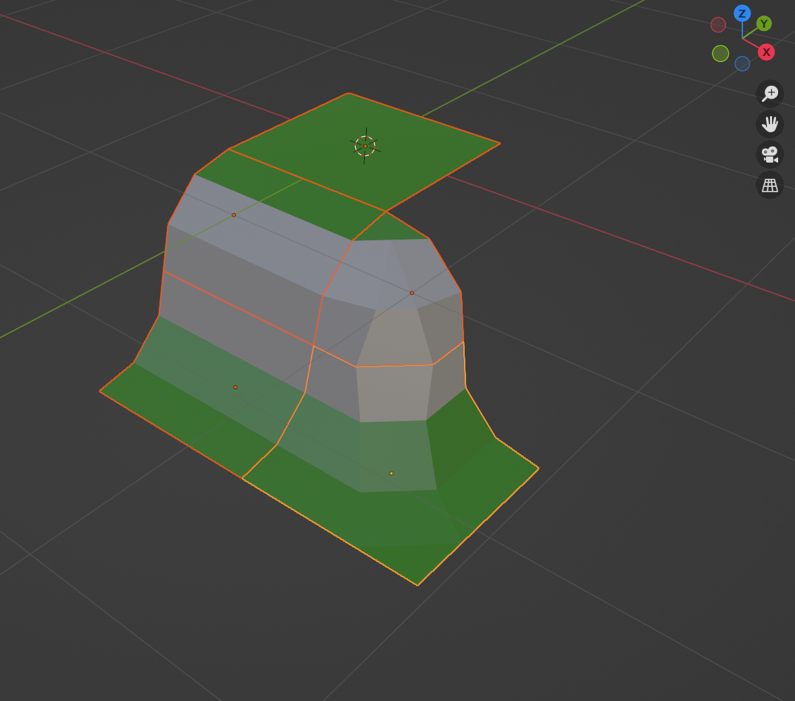

# Wave Function Collapse - Golang

A simple implementation of Wave Function Collapse for procedural terrain generation written in Golang. This is largely a direct port of [Martin Donald's](https://www.youtube.com/@MartinDonald) work in Godot. An overview of his process and inspiration can be found [here](https://www.youtube.com/watch?v=2SuvO4Gi7uY).

The purpose of pulling this portion of the process out of GDScript and into Godot is to minimize the amount of computation that needs to occur in-engine. Long-term, I would like to use this to design an API capable of generating, storing, and retreiving maps.

## Demonstration



See the `GodotDemo` directory for more information.

I used this simple, five-module set that I made in Blender:



## Instructions

1. Create a compatible tileset in Blender. Each module (prototype) must be contained in a 1x1x1 meter bounding box; asymmetrically sized modules are not currently supported. Generally, it is advised to create non-enclosed modules, that is, deformed planes tend to work better than cubes and other "solid" shapes.
    - TODO - make more explicit, provide simple example set

2. Create a script which calculates basic adjacency constraints. I am using a modified version of Martin Donald's Blender script, available to his Patreons [here](https://www.patreon.com/bolddunkley). The output of this script should be a JSON object whose keys are prototype IDs or names, and whose values can be represented by the following Golang struct:

    ```golang
    type WFCPrototype struct {
        MeshName        string     `json:"mesh_name"`
        MeshRotation    int        `json:"mesh_rotation"`
        PosX            string     `json:"posX"`
        NegX            string     `json:"negX"`
        PosY            string     `json:"posY"`
        NegY            string     `json:"negY"`
        PosZ            string     `json:"posZ"`
        NegZ            string     `json:"negZ"`
        ConstrainTo     string     `json:"constrain_to"`
        ConstrainFrom   string     `json:"constrain_from"`
        Weight          int        `json:"weight"`
        ValidNeighbours [][]string `json:"valid_neighbours"`
    }
    ```

    - TODO - make more explicit, provide simplified example or pseudocode

3. Run this program with `go run . --input prototype_data.json --output map.json`, substituting `prototype_data.json` and `map.json` as needed.

4. Use the `map.json` file to load the map in your engine of choice. A demonstration can be found in the `GodotDemo` directory.
